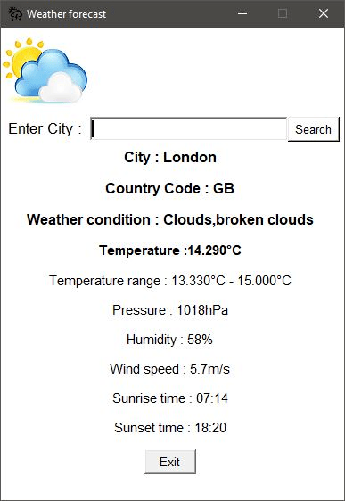

# Weather Forecast
Fetches the weather forecast based on the location (city) entered by the user from openweathermap.org .

The application displays the following:
* Weather condition
* Temperature range
* Pressure
* Humidity
* Wind speed
* Sunrise and Sunset time.

## Preinstallations
- You need Python 3 installed on your computer.
Click [here](https://www.python.org/downloads/) to download.
- You need an account on OpenWeatherMap to generate your API key. Click [here](https://openweathermap.org/).


## Setup instructions
* Clone the repository:

```git clone https://github.com/Praveena1109/WeatherForecast.git```

* Navigate to folder: ```cd WeatherForecast```

* Add your OpenWeatherMap API key in ```GUI_weatherForecast.py``` .
* Run  ```python GUI_WeatherForecast.py```

## Adding required libraries
The ```requirements.txt``` file should list all Python libraries that this project depends on, and this can be installed using:

```pip install -r requirements.txt```

## Modules used
- Urllib - It is the URL handling module for python.
- Json, Requests
- Pillow - It is a Python Imaging Library (PIL), which adds support for opening, manipulating, and saving images.
- Tkinter - Interface to Tcl/Tk for graphical user interfaces (GUI). Tkinter is included with standard Linux, Microsoft Windows and Mac OS X installs of Python.
 
  Error -  It says ```tkinter ``` can't be imported. To solve this error :
 
  - For windows - ``` pip install python-tk ```
  - For Ubuntu - ```sudo apt-get install python-tk```
 
 ## Screenshot


